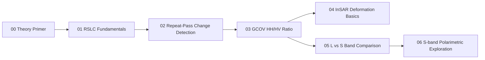

# NISAR Tutorial — Hands-On SAR & InSAR with Real NISAR Data

A hands-on Python tutorial for working with NASA-ISRO SAR (NISAR) mission data, built
entirely on five real NISAR sample products (RSLC, GCOV, and GUNW; L-band and S-band).
It teaches SAR and InSAR analysis **techniques** — reading complex SLC data, multilooking,
backscatter differencing, polarimetric ratios, coherence-based masking, cross-band
comparison — using real data throughout, but it is **not** a collection of validated
real-world case studies. See ["What this repo is and isn't"](#what-this-repo-is--and-isnt)
below before drawing any conclusions from what's shown.

## Quick Start

```bash
conda create -p venv python==3.12
conda activate venv/
pip install -r requirements.txt
jupyter notebook modules/00_sar_theory_primer/notebook.ipynb
```

Module 00 (the theory primer) needs no data files and runs standalone — start there.
Modules 01-06 read from `SampleData/`, which you'll need to populate yourself (see
below) before running them.

## Data note

`SampleData/` is listed in `.gitignore` — **the five real `.h5` files are not included
in this repository** (two of them alone are 14-25 GB, and NISAR data has its own
distribution terms). This repo ships the code and a full metadata record instead:

- [`docs/data_inventory.md`](docs/data_inventory.md) — full metadata for each of the 5
  files (track/frame, acquisition dates, geographic extent, polarizations, covariance
  terms present), confirmed directly from each file's own HDF5 attributes.
- [`docs/data_access.md`](docs/data_access.md) — how to obtain equivalent data from ASF
  DAAC (NASA/L-band) or ISRO Bhoonidhi (S-band), and how to point the notebooks at it.

| # | Filename | Product | Band |
|---|---|---|---|
| 1 | `NISAR_L1_PR_RSLC_025_034_D_073_2005_DHDH_M_20260710T133917_20260710T133952_P05023_N_F_J_001.h5` | RSLC (L1) | L |
| 2 | `NISAR_L1_PR_RSLC_026_034_D_073_4005_DHDH_A_20260722T133916_20260722T133951_P05023_N_F_J_001.h5` | RSLC (L1) | L |
| 3 | `NISAR_L2_PR_GCOV_026_091_D_075_4005_DHDH_A_20260726T123348_20260726T123423_P05023_N_F_J_001.h5` | GCOV (L2) | L |
| 4 | `NISAR_L2_PR_GUNW_025_034_D_073_026_2000_SH_20260710T133917_20260710T133952_20260722T133916_20260722T133951_P05023_N_F_J_001.h5` | GUNW (L2) | L |
| 5 | `NISAR_S2_PR_GCOV_025_141_A_015_3700_DHNA_A_20260717T231346_20260717T231423_P00500_M_F_I_001.h5` | GCOV (L2) | S |

Files 1, 2, and 4 are a matched set: File 4 (GUNW) is formed from Files 1 and 2 as its
reference/secondary pair — confirmed from File 4's own metadata, not filename parsing
(see `tests/test_io.py`).

## Modules



| Module | File(s) used | Technique demonstrated | Scope note |
|---|---|---|---|
| [00 — SAR Theory Primer](modules/00_sar_theory_primer/notebook.ipynb) | none (real wavelengths pulled from Files 1 & 5) | SAR fundamentals: geometry, speckle statistics, scattering mechanisms, polarimetry, InSAR phase | Conceptual reference with synthetic demos — no scene-specific claims |
| [01 — RSLC Fundamentals](modules/01_rslc_fundamentals/notebook.ipynb) | File 1 | Reading complex SLC, amplitude/phase, multilooking, speckle statistics | Illustrates a technique on real data — not a land-cover finding |
| [02 — Repeat-Pass Change Detection](modules/02_repeat_pass_change_detection/notebook.ipynb) | Files 1 & 2 | Geometric coregistration, backscatter differencing | Change-detection technique — not tied to a documented event |
| [03 — GCOV HH/HV Ratio Analysis](modules/03_gcov_polarimetric_analysis/notebook.ipynb) | File 3 | Covariance-term reading, HH/HV power ratio, illustrative threshold split | Ratio technique only — this file has diagonal covariance terms only, so no true decomposition; the threshold split is illustrative, not a validated classification |
| [04 — InSAR Deformation Basics](modules/04_insar_deformation_basics/notebook.ipynb) | File 4 | Unwrapped phase, coherence-based masking, phase-to-displacement theory | Interferometric technique — not a validated deformation measurement |
| [05 — L-band vs S-band Comparison](modules/05_lband_vs_sband_comparison/notebook.ipynb) | Files 3 & 5 | Cross-band backscatter comparison over a confirmed shared footprint | Frequency-physics demonstration — not a land-cover classification |
| [06 — S-band GCOV Polarimetric Exploration](modules/06_sband_gcov_standalone/notebook.ipynb) | File 5 | HH-HV correlation coefficient, estimator-bias check | Dual-pol correlation only — not full polarimetric decomposition (that needs quad-pol data) |

## What this repo is — and isn't

**This repo is:**
- A hands-on introduction to reading, processing, and visualizing real NISAR
  RSLC/GCOV/GUNW data, using product readers (`nisar_tools/io.py`) that auto-detect band
  and product type from each file's own metadata rather than hardcoding per-file logic.
- A demonstration of real SAR/InSAR techniques — multilooking, backscatter differencing,
  HH/HV ratio computation, coherence-based masking, cross-band comparison, dual-pol
  correlation — checked against the underlying theory (Module 00) rather than presented
  as black-box code.
- Honest about places where a first-pass result looked right and turned out not to be —
  see [Lessons learned](#lessons-learned) below, kept in the notebooks rather than
  scrubbed out.

**This repo is not:**
- A validated case study of any real-world event. No flood, subsidence, deforestation,
  or other event has been confirmed for any scene shown here — Module 02's
  change-detection map and Module 04's interferogram are technique demonstrations on
  whatever backscatter/phase pattern happened to be present between these sample dates,
  not evidence that anything occurred.
- Ground-truthed. No field survey, GNSS, optical reference imagery, or independent
  land-cover map has been used to check any classification, ratio threshold, or
  displacement estimate here.
- Radiometrically or atmospherically corrected beyond what each product delivers by
  default. Module 02 finds and flags an uncorrected cross-acquisition calibration
  difference; Module 04 finds and flags an uncorrected atmospheric/orbital phase ramp —
  both are identified, neither is corrected.
- A substitute for a full NISAR processing pipeline or a SAR/InSAR course — derivations
  and production-grade calibration/coregistration are explicitly out of scope (Module 00
  says so directly).

**What real-world deployment of any of these techniques would additionally need**
(pulled from each module's own closing cell, not generic boilerplate):
- Validated event dates/windows and an independent reason to compare the specific dates
  used, not an arbitrary demo window.
- Radiometric cross-calibration between acquisitions (Module 02), not just geometric
  coregistration.
- Sub-pixel, cross-correlation-refined coregistration (Module 02) rather than the coarse
  metadata-derived offsets used here.
- Atmospheric/ionospheric correction (Module 04) — GUNW's `ionospherePhaseScreen` layer
  exists for this and is not applied here.
- A longer multi-date stack / time series (Modules 02, 04) to separate genuine change or
  deformation from noise, calibration drift, or atmosphere.
- Ground truth — field surveys, reference land-cover maps, GNSS/leveling data — to check
  any threshold, ratio, or displacement estimate (Modules 03, 04, 06).
- Quad-pol data for genuine polarimetric decomposition (Module 06) — this repo's dual-pol
  samples cap out at a correlation coefficient.
- Radiometric terrain correction, given the real elevation relief present in these scenes
  (Modules 03, 05, 06).

## Lessons learned

Building this tutorial against real data surfaced a few results that looked plausible at
first glance and needed a second look before they were right. They're presented here as
a teaching asset, not a bug list — working through *why* something looked right but
wasn't is as instructive as the clean result, and each case is explained in place in its
notebook rather than quietly fixed and hidden.

| Module | What it looked like at first | What it actually was | How it was caught |
|---|---|---|---|
| 01 | A center-window speckle measurement gave a coefficient of variation of 5.3, vs. the ~1.0 theory predicts for single-look speckle | The window spanned a canal/road feature and mixed field boundaries — real land-cover heterogeneity, not speckle | Searched the window for its most homogeneous sub-patch; even that patch (CV 2.15) still showed real texture, which is explained rather than hidden |
| 02 | The backscatter difference map looked like widespread real change (72% of pixels beyond a 3 dB threshold) | Broad vertical banding consistent with a range-dependent radiometric difference between the mixed-mode and full-bandwidth acquisitions, not surface change | The banding was far too wide and smooth to be field-scale change; traced to the two files' different processing modes |
| 04 | A large, smooth unwrapped-phase gradient (~60 radians) could be read as a deformation signal | Converting it to displacement via this file's real L-band wavelength gives over a meter of apparent motion in 12 days — implausible, and much more consistent with a residual atmospheric/orbital phase ramp | Applied the phase-to-displacement equation with the real wavelength as a plausibility check before any interpretation |
| 06 | The HH-HV correlation map (mean \|rho\| = 0.52) looked spatially structured, and a first draft claimed it showed the same river feature visible in Module 05's backscatter | It didn't — and averaging more samples drove the mean magnitude down to 0.08, the signature of a biased estimator at low true correlation, not real structure | Ran a multilook bias check before trusting the visual impression, mirrored by a controlled synthetic demo in Module 00 |

Module 00 now works through the same two statistical traps (speckle CV, correlation
estimator bias) with synthetic data first, so the pattern is visible before you hit it
for real in Modules 01 and 06.

## Repo structure

```
NISAR_Tutorial/
├── README.md
├── LICENSE
├── .gitignore
├── requirements.txt
├── venv/                          # created locally via Quick Start, gitignored
├── SampleData/                    # real .h5 files, gitignored — see docs/data_access.md
├── docs/
│   ├── data_inventory.md          # full metadata for all 5 sample files
│   ├── data_access.md             # how to obtain equivalent data
│   └── product_guide.md           # RSLC/GCOV/GUNW reference glossary
├── nisar_tools/                   # shared, importable package
│   ├── __init__.py
│   ├── io.py                      # product readers (RSLC/GCOV/GUNW, band-auto-detect)
│   ├── preprocess.py              # multilooking, dB conversion, coregistration, masking
│   └── viz.py                     # quicklook plotting helpers
├── modules/
│   ├── 00_sar_theory_primer/notebook.ipynb
│   ├── 01_rslc_fundamentals/notebook.ipynb
│   ├── 02_repeat_pass_change_detection/notebook.ipynb
│   ├── 03_gcov_polarimetric_analysis/notebook.ipynb
│   ├── 04_insar_deformation_basics/notebook.ipynb
│   ├── 05_lband_vs_sband_comparison/notebook.ipynb
│   └── 06_sband_gcov_standalone/notebook.ipynb
├── scripts/
│   └── inspect_nisar_h5.py        # metadata/structure inspection tool
└── tests/
    └── test_io.py                 # smoke tests against the real sample files
```

## Requirements & environment

- Python 3.12 (via conda)
- Dependencies are pinned in `requirements.txt` to the versions this repo was built and
  tested against (`h5py`, `numpy`, `scipy`, `matplotlib`, `xarray`, `rioxarray`,
  `rasterio`, `geopandas`, `shapely`, `pyproj`, `cartopy`, `folium`, `jupyter`,
  `ipykernel`, `pytest`).
- Setup is the four Quick Start commands above. `jupyter`/`ipykernel` installed inside
  the `venv/` environment automatically register a `python3` kernel scoped to that
  environment (check with `jupyter kernelspec list`), so `jupyter notebook` launched
  from the activated `venv/` uses the right interpreter with no extra kernel setup.
- Run `pytest tests/test_io.py` to verify `nisar_tools` against your own copy of
  `SampleData/` (tests skip gracefully if the data isn't present).

## License

MIT — see [LICENSE](LICENSE).

## Data attribution

NISAR is a joint NASA-ISRO mission. If you reuse this repo's approach with your own
downloaded NISAR data, cite the mission and data source appropriately — for example,
NASA's Alaska Satellite Facility DAAC (https://asf.alaska.edu) for L-band products
and/or ISRO's Bhoonidhi platform (https://bhoonidhi.nrsc.gov.in) for S-band products,
including the specific product DOI recorded in each file's own
`identification/productDoi` metadata attribute where available. This repo's own sample
files are not redistributed (see [Data note](#data-note)), so no specific product DOI is
being cited here.
